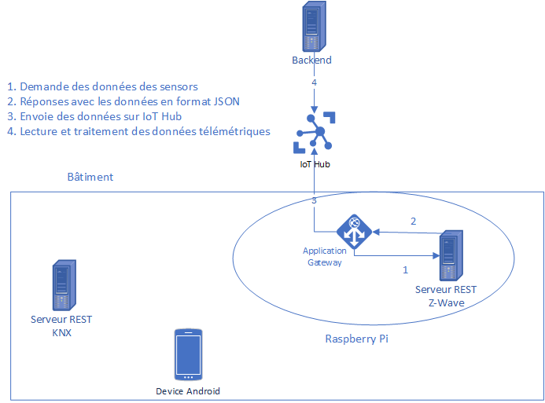
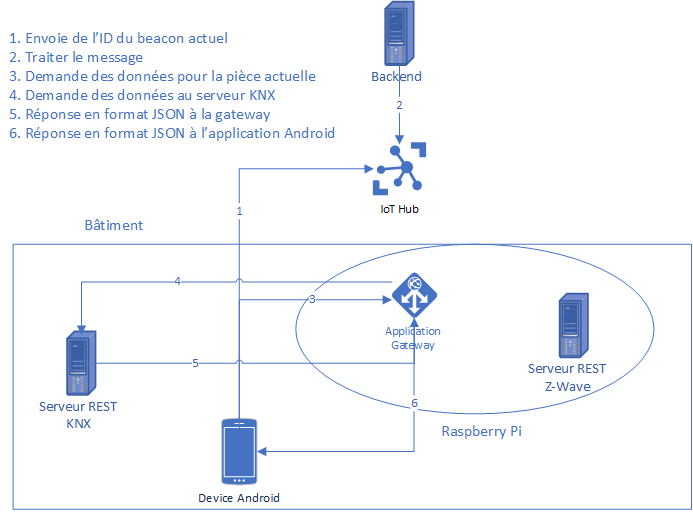

# Msc - Projet IoT - Smartbuilding
## Auteurs : Daniel Oliveira Paiva et Edin Mujkanovic

### Introduction
Ce projet a pour but de développer un logiciel permettant de fournir aux utilisateurs des fonctionnalités permettant de : 
* Baisser la température d'une pièce à une valeur fixée lorsqu'elle est vide.
* Augmenter la température d'une pièce à une valeur fixée lorsqu'elle est occupée.
* Fermer les stores lorsque l'humidité est élevée. 
* Ouvrir les stores lorsqu'il fait jour, lorsque la luminosité est faible et que la pièce est occupée.
* Afficher dans une application Android les status des stores et des radiateurs. 
* Définir les valeurs des stores et des radiateurs depuis l'application Android.

### Architecture du projet

 

### Exécuter le projet 
Afin d'exécuter le projet, il faut effectuer les étapes suivantes :
* Mettre en place l'infrastrcture :
    * Brancher la Raspberry pi (courant et réseau)
    * Brancher la clé Z-Wave
    * Brancher le capteur 
* Exécuter le serveur KNX (plus d'informations dans le README situé dans le dossier `knx`)
* Exécuter le serveur `zwave` (plus d'informations dans le README situé dans le dossier `zwave`)
* Exécuter la gateway (plus d'informations dans le README situé dans le dossier `gateway`)
* Exécuter le backend (plus d'informations dans le README situé dans le dossier `backend`)
* Compiler et exécuter l'application `Android`